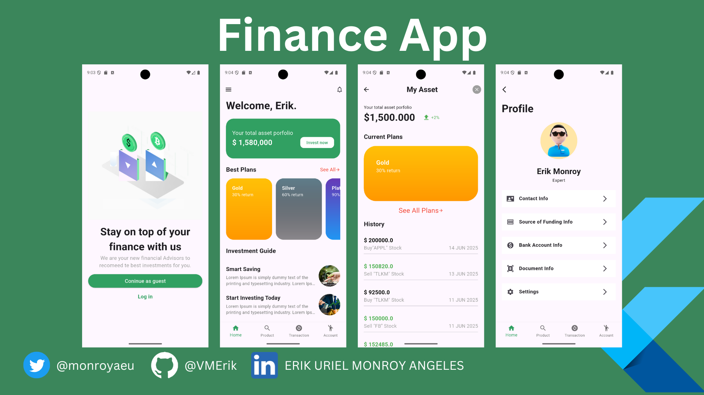

# Finance App App

Maquetacion de aplicación movil para administracion financiera.
Esta documentación detalla la configuración, dependencias y estructura básica del proyecto.
El el usarmos GoRouter como sistema de navegacion y el uso de objetos como parametros compartidos entre paginas

**Inspiracion tomada de** Figma Comunity
Te dejo el link de la plantilla en Figma, aqui abajo 👇👇 

[Ver plantilla en Figma](https://www.figma.com/design/P1INnUteeIrbJz93plXkO7/Invest-App----Base?node-id=141-2462&p=f&t=sZaPC4vylmGFtbfd-0)


## 📦 Información del Proyecto

| Campo         | Valor                  |
|---------------|------------------------|
| **Nombre**    | FinanceApp           |
| **Descripción** | Maquetacion de aplicación movil para administracion financiera.|
| **Versión**   | 0.1.0                  |
| **SDK**       | Flutter 3.7.2          |
| **Publicación** | No se publica (`publish_to: none`) |


## 📁 Estructura del proyecto

```plaintext
/lib
  /models         # Modelos de datos (simulacion)
  /pages          # Vistas de la aplicación
  /routes         # Configuracion de Rutas con GoRoute
  /widgets        # Componentes reutilizables

/assets
  /img             # Imágenes usadas en la app
```

## ▶️ Cómo iniciar el proyecto 
```flutter pub get``` 
```flutter run ``` 


## 📷 Vista previa de vistas
